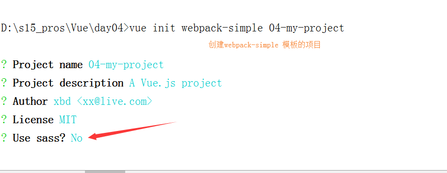
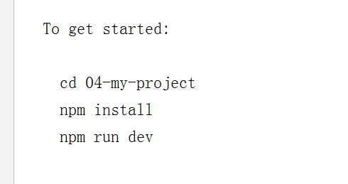
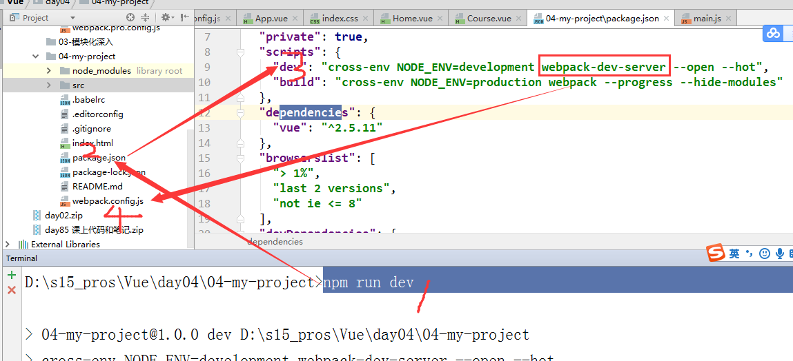
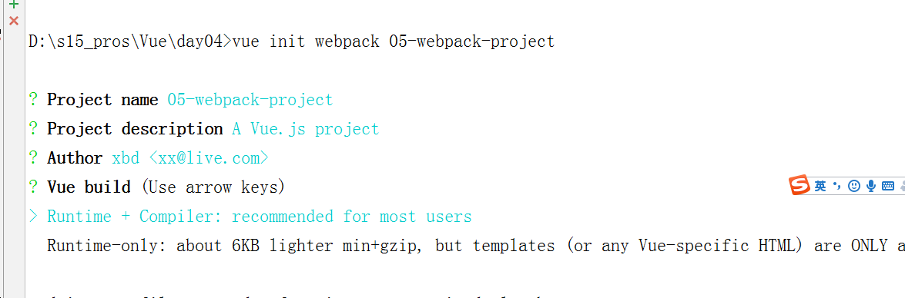

### 

#### es6的语法

###### let

```js
特点：
1.局部作用域
2.不会存在变量提升
3.变量不能重复声明
```

###### const

```js
特点：	
1.局部作用域 
2.不会存在变量提升 
3.不能重复声明，只声明常量 不可变的量
```

###### 在vue中let var 和const 区别

```
let和const   使用方法：

　　(1).有没有感觉到在javascript使用var会发生变量提升，即脚本开始运行时，变量已经存在了，但是没有值，所		以会输出undefined。
　　	  而let不会发生变量提升,这表示在声明它之前，变量是不存在的，这时如果用到它，就会抛出一个错误。
　　(2). var 是函数级作用域，let是块级作用域   
          例子：
                {
                    let n = 10;
                    var m = 1;
                }
          结果：n //      会报错：ReferenceError:a is  not defined.
          结果：m // 1

　　(2).let不允许在相同作用域内，重复声明同一个变量:
           例子：
               function(){

                let n = 10;

                var n = 1;

              }//报错
              function(){

                let n = 10;

                let n = 1;

              } //报错
　　(3).const声明一个只读的常量,且声明后，常量的值是不能改变的
          const PI = 3.1415;
          PI = 3;
          //报出异常：TypeError: Assignment to constant variable

　　(4).const命令声明的常量也是不提升，只能在声明的位置后面使用。
         例子：
              {
                const a = 10;
              }
　　			console.log(a);
　　   		//报错

　　(5).const与let  一样不可重复声明

　　(6).复合类型的变量，变量名不指向数据，它是指向数据所在的地址,
    const只保证变量名指向的地址是不变的，并不能保证它地址的数据是不变的,
　   所以将一个对象声明为常量必须非常小心.
      const n = {};
      n.prop = aaa;
      console.log(n.prop);    // aaa
      n = {}; // 报错
```


###### 模板字符串

```js
tab键上面的反引号 ${变量名}来插值
let name = '未来';
let str = `我是${name}`
```

###### 箭头函数

function(){} ===  ()=>{} this的指向发生了改变

###### es6的类

原型 prototype  当前类的父类（继承性）

```javascript
	class Person{
		constructor(name){
			this.name = name;
		}
		fav(){
		}			
	}
	Vue的基本用法
```

### vue的介绍

前端有三大框架：   可以去github查看三个框架的 star星

| 框架  | 介绍                                               |
| ----- | -------------------------------------------------- |
| vue   | 尤雨溪,渐进式的JavaScript框架                      |
| react | Facebook公司，里面的高阶函数非常多，对初学者不用好 |

| angular | 谷歌公司，目前更新到6.0，学习angular得需要玩一下typescript		
 Vue     angular2.0 3.0~6.0   React(高阶函数 es6)初学者不友好 |

###### vue的基本引入和创建 

- 1.下载

  cdn方式下载

  ```html
  <script src="https://cdn.jsdelivr.net/npm/vue@2.5.17/dist/vue.js"></script>
  ```

- 2.引包

```html
  <script src='./vue.js'></script>
```

- 3.实例化

  ```js
  //2.实例化对象
  <script>
      new Vue({
          el:'#app', //绑定那块地
          data:{
              //数据属性  种子
              msg:'黄瓜',
              person:{
                  name:'wusir'
              },
              msg2:'hello Vue'
          }
      });
  </script>
  ```

###### Vue的模板语法

可以插入任何你想插入的内容，除了if-else if-else用三元运算符代替

```html
<div>
	<!--模板语法-->
    <h2>{{ msg }}</h2>
    <h3>{{ 'hhahda' }}</h3>
    <h3>{{ 1+1 }}</h3>
    <h4>{{ {'name':'alex'} }}</h4>
    <h5>{{ person.name }}</h5>
    <h2>{{ 1>2? '真的': '假的' }}</h2>
	<p>{{ msg2.split('').reverse().join('') }}</p>
</div>

```

###### Vue的指令系统之v-text和v-html**

```js
{{}}
v-text相当于innerText
v-html相当于innerHTML
```

###### Vue的指令系统之v-if和v-show

```js
v-show 相当于 style.display
```

###### v-if和v-show的区别

记住：

```js
v-if vs v-show
v-if 是“真正”的条件渲染，因为它会确保在切换过程中条件块内的事件监听器和子组件适当地被销毁和重建。

v-if 也是惰性的：如果在初始渲染时条件为假，则什么也不做——直到条件第一次变为真时，才会开始渲染条件块。

相比之下，v-show 就简单得多——不管初始条件是什么，元素总是会被渲染，并且只是简单地基于 CSS 进行切换。

一般来说，v-if 有更高的切换开销，而 v-show 有更高的初始渲染开销。因此，如果需要非常频繁地切换，则使用 v-show 较好；如果在运行时条件很少改变，则使用 v-if 较好。

v-if多个条件判断语句
还有条件则继续增加v-else-if

// 我这里是三个条件，如果还有条件则继续增加 v-else-if
	<div v-if="item.enable === '已签到'">
		<span class="badge badge-success">{{ item.enable }}</span>
	</div>
	<div v-else-if="item.enable === '缺勤'">
		<span class="badge badge-danger">{{ item.enable }}</span>
	</div>
	<div v-else-if="item.enable === '请假'">
		<span class="badge badge-warning">{{ item.enable}}</span>
	</div>

```

```html
<!DOCTYPE html>
<html lang="zh-CN">
<head>
    <meta charset="UTF-8">
    <title>Title</title>
    <meta name="viewport" content="width=device-width, initial-scale=1">
    <style>
        .box {
            width: 200px;
            height: 200px;
            background-color: red;
        }

        .box2 {
            width: 200px;
            height: 200px;
            background-color: green;
        }
    </style>
</head>
<body>

<div id="content">
    {{ add(2,3) }}
    <button v-on:click='handlerClick'>隐藏</button>
    <div class="box" v-show='isShow'></div>
    <div class="box2" v-if="isShow"></div>

    <div v-if="Math.random() > 0.5">
        有了
    </div>
    <div v-else>
        没了
    </div>

</div>
<!--1.引包-->
<script src='./vue.js'></script>
<script>
    //数据驱动视图
    new Vue({
        el: '#content',
        data() {
            //data中是一个函数 函数中return一个对象，可以是空对象 但不能不return
            return {
                msg: "<h2>alex</h2>",
                num: 1,
                isShow: true
            }
        },
        methods: {
            add(x, y) {
                console.log(this.num);
                return x + y
            },
            handlerClick() {
                //数据驱动
                console.log(this);
                this.isShow = !this.isShow;

            }
        }
    })
</script>

</body>
</html>

```

###### v-bind 和v-on

```js
v-bind可以绑定标签中任何属性  
v-on 可以监听 js中所有事件

简写：
v-bind:src  等价于   :src
v-on:click 等价于 @click

```

```html
<!DOCTYPE html>
<html lang="zh-CN">
<head>
    <meta charset="UTF-8">
    <title>Title</title>
    <meta name="viewport" content="width=device-width, initial-scale=1">
    <style>
        .box {
            width: 200px;
            height: 200px;
            background-color: red;
        }
        .active{
            background-color: green;
        }

    </style>
</head>
<body>

<div id="app">
    <!--<button v-on:click = 'handlerChange'>切换颜色</button>-->
   <!--v-bind 标签中所有的属性 img标签src alt,a标签的href title id class-->
    <!---->
    <!--<div class="box" v-bind:class = '{active:isActive}'></div>-->

     <button @mouseenter = 'handlerChange' @mouseleave = 'handlerLeave'>切换颜色</button>
   <!--v-bind 标签中所有的属性 img标签src alt,a标签的href title id class-->
    
    <div class="box" :class = '{active:isActive}'></div>
</div>
<!--1.引包-->
<script src='./vue.js'></script>
<script>
    //数据驱动视图  设计模式 MVVM  Model  View  ViewModel
    //声明式的JavaScript框架
//    v-bind和v-on的简便写法 :  @
    new Vue({
        el: '#app',
        data() {
            //data中是一个函数 函数中return一个对象，可以是空对象 但不能不return
            return {
                imgSrc:'./1.jpg',
                msg:'美女',
                isActive:true
            }
        },
        methods:{
            handlerChange(){
//                this.isActive = !this.isActive;
                this.isActive = false;
            },
            handlerLeave(){
                this.isActive = true;
            }
        }
       
    })
</script>

</body>
</html>

```

###### v-for 遍历列表

```javascript
v-for可以遍历列表，也可以遍历对象
在使用vue的v-for指令的时候，一定要绑定key,避免vue帮咱们计算DOM

```

```html
<!DOCTYPE html>
<html lang="zh-CN">
<head>
    <meta charset="UTF-8">
    <title>Title</title>
    <meta name="viewport" content="width=device-width, initial-scale=1">
    <style>
        .box {
            width: 200px;
            height: 200px;
            background-color: red;
        }
        .active {
            background-color: green;
        }
    </style>
</head>
<body>
<div id="app">
    <ul v-if="data.status === 'ok'">
       <!--v-for的优先级是最高的     diff算法-----for循环必须绑定:key,数据有id绑定id,否则绑定index----->
        <li v-for = '(item,index) in data.users' :key="item.id" >
            <h3>{{ item.id }} -- {{ item.name }} -- {{ item.age }}</h3>
        </li>
    </ul>
    <div v-for = '(value,key) in person'>
        {{ key }}-----{{ value }}
    </div>
</div>
<!--1.引包-->
<script src='./vue.js'></script>
<script>
    new Vue({
        el: '#app',
        data() {
            return {
                data: {
                    status: 'ok',
                    users: [
                        {id: 1, name: 'alex', age: 18},
                        {id: 2, name: 'wusir', age: 30},
                        {id: 3, name: 'yuan', age: 48}
                    ]
                },
                person:{
                    name:'alex'
                }
            }
        },
        methods: {}
    })
</script>
</body>
</html>

```

###### watch侦听器

```html
<!DOCTYPE html>
<html lang="en">
<head>
    <meta charset="UTF-8">
    <title>Title</title>
</head>
<body>
    <div id="app">
        <p>{{ msg }}</p>
        <button @click = 'clickHandler'>修改</button>
    </div>
<script src="./vue.js"></script>
<script>
    new Vue({
        el:'#app',
        data(){
            return {
                msg:'alex',
                age:'19'
            }
        },
        methods:{
            clickHandler(){
                this.msg = 'fdfsf'
            }
        },
        watch:{
            // watch监听单个属性，如果想监听多个属性需声明多个属性的监听
            'msg':function (val) {
                console.log(val);
                if (val === 'fdfsf'){
                    this.msg = '大大'
                }
            },
            'age':function (val) {

            }
        }
    })
</script>
</body>
</html>

```

###### computed 计算属性

```html 
<!DOCTYPE html>
<html lang="en">
<head>
    <meta charset="UTF-8">
    <title>Title</title>
</head>
<body>
    <div id="app">
        <p>{{ myMsg }}</p>
        <button @click = 'clickHandler'>修改</button>
    </div>
<script src="./vue.js"></script>
<script>
    let vm=new Vue({
        el:'#app',
        data(){
            return {
                msg:'alex',
                age:'19'
            }
        },
        // created() {
        //     //定时器  ajax  库 function(){}时用箭头函数
        //     setInterval(() => {
        //
        //     })
        // },
        methods:{
            clickHandler(){
                //this的指向就是当前实例对象vm
                this.msg = 'fdfsf';
                this.age=20

            }
        },
        computed:{
            // 计算属性在声名一次的情况下可以监听多个属性
            myMsg:function(){
                // 业务逻辑 

            //    计算属性默认只有getter方法
                return `我的名字叫${this.msg},年龄是${this.age}`;
            }
        }
    })
</script>
</body>
</html>

```


##### Typora中markdown图片相对路径设置

​	文件-》偏好设置->


表单输入绑定 

##### 数据双向绑定 v-model

> ​		https://cn.vuejs.org/v2/guide/forms.html
>
> v-model 只能应用于像 <input> 、 <textare>、 <select>标签 中
>
> 举例：
>
> ```html
> <!DOCTYPE html>
> <html lang="en">
> <head>
>     <meta charset="UTF-8">
>     <title>Title</title>
> </head>
> <body>
>     <div id="app">
>         <input type="text" v-model="msg" />
>         <br>
>         {{ msg }}
>     </div>
> <script src="vue.js"></script>
> <script>
>     // 双向的数据绑定，使用 v-model
>     new Vue({
>         el:'#app',
>         data(){
>             return {
>                 msg:'alex',
>             }
>         }
>     })
> </script>
> </body>
> </html>
> ```

##### 组件化开发  

https://cn.vuejs.org/v2/guide/components.html

###### 1、全局组件

```html
<!DOCTYPE html>
<html lang="en">
<head>
    <meta charset="UTF-8">
    <title>Title</title>
</head>
<body>
<div id="app">
    // 可以在template中调用也可以在这里使用
</div>
<script src="vue.js"></script>
<script>
    // 全局组件声名，第一个参数是组件的名字，第二个参数　options
    Vue.component('Vbtn',{
        data(){
            return {
            }
        },
        template:`
            <button>按钮</button>
        `,
    });
    new Vue({
        el:'#app',
        data(){
            return {
                msg:'alex'
            }
        },
        template:`
            <div class="app">
                <Vbtn></Vbtn>
            </div>
        `,
        // 2、 挂子,全局组件不要需要挂子，可直接调用
        components:{  
        }
    })
</script>
</body>
</html>
```

Vue提供的内置组件<slot></slot>表示分发

```html
<!DOCTYPE html>
<html lang="en">
<head>
    <meta charset="UTF-8">
    <title>Title</title>
</head>
<body>
<div id="app">
   
</div>
<script src="vue.js"></script>
<script>
    // 全局组件声名，第一个参数是组件的名字，第二个参数　options
    Vue.component('Vbtn',{
        data(){
            return {
            }
        },
        template:`
            <button>
            	<slot></slot>
            </button>
        `,
    });

    new Vue({
        el:'#app',
        data(){
            return {
                msg:'alex'
            }
        },
        template:`
            <div class="app">
                <Vbtn>登录</Vbtn><!--在这里可以任意定制，例如登陆按钮-->
                <Vbtn>注册</Vbtn><!--- 注册按钮 ---> 
            </div>
        `,
        // 2、 挂子,全局组件不要需要挂子，可直接调用
        components:{
            
        }
    })
</script>
</body>
</html>
```

###### 2、局部组件

​	步骤：

​		1、声名组件（声子）

​		2、 挂嵌到父组件 （挂子）

​		3、应用组件 （用子）

```html
<!DOCTYPE html>
<html lang="en">
<head>
    <meta charset="UTF-8">
    <title>Title</title>
</head>
<body>
<div id="app">

</div>
<script src="vue.js"></script>
<script>
    // 如果仅仅是实例化 Vue 对象中既有　el  又有　template，如果template中有定义模板的内容
    // 那么template模板的优先级大于el
    // App 、header 、aside 、content
    // 1、声子  Vue中组件的名字 首字母要大写 跟标签区分 组件中的data必须是个函数 一定要有返回值
    let App={
        data(){
            return {
                text:'hjksdhjk'
            }
        },
        // template必须是闭合标签
        template:`
            <div id="a">
                <h2>{{ text }}</h2>
            </div>
        `,
    };
    new Vue({
        el:'#app',
        data(){
            return {
                msg:'alex'
            }
        },
        // template:`
        //     <div class="app">
        //         <h2>{{ msg }}</h2>
        //     </div>
        // `,
        // ３、使用子
        template:`
            <div class="app">
                <App/>
            </div>
        `,
        // 2、 挂子,局部组件需要挂，全局组件在任意地方直接使用
        components:{
            // 如果key和value一样 可以只写一个
            //App:App,
            App
        }
    })
</script>
</body>
</html>
```

###### 3、组件的嵌套

###### 4、父子组件传值

```html
父 ==〉子
父= 》子 

​（1）在子组件中 声明props 只要声明了该属性，那么就可以在组件中任意使用
​（2）在父组件通过绑定自定义属性 挂载数据属性
<!DOCTYPE html>
<html lang="en">
<head>
    <meta charset="UTF-8">
    <title>Title</title>
</head>
<body>
<div id="app">
    
</div>
<script src="vue.js"></script>
<script>
    
    let Vheader={
        data(){
            return {
            }
        },
        // 挂载父组件的属性 使用props声明 可以在子组件中任意使用
        props:['msg','post','title'],
        // 模板里面一定是闭合标签,template定义模板内容
        template:`我是子组件：
            <div>
                <h2>jj</h2>
                <h2> {{ msg }}</h2>
                <h2>{{ post.title }}</h2>
                <h2> {{ title }} </h2>
            </div>
        `,
    };
    let App={
        data(){
            return {
                text:'我是父组件的数据',
                post:{
                    id:1,
                    title:'My Journey with me'
                }
            }
        },
        template:`
            <div id="a">
<!--                <h2>{{ text }}</h2>-->
<!--				// 定义自定义的属性-->
<!--                :post是指动态的绑定data()中的数据，也可以直接静态的绑定数据 例如 <Vheader title='alex></Vheader>-->
                <Vheader :msg="text" :post='post' title="alex"></Vheader>
            </div>
        `,
        methods:{
        },
        components:{
            Vheader
        }
    };
    new Vue({
        el:'#app',
        data(){
            return {
                msg:'alex'
            }
        },
        template:`<App></App>`,
        // 2、 挂子
        components:{
            App
        }
    })
</script>
</body>
</html>


子 ===》 父

（1）在子组件中 通过this.$emit('方法名'，值)
（2）在父组件中 绑定自定义的事件

<!DOCTYPE html>
<html lang="en">
<head>
    <meta charset="UTF-8">
    <title>Title</title>
</head>
<body>
<div id="app">

</div>
<script src="vue.js"></script>
<script>
    Vue.component('VBtn',{
       data(){
           return {}
       },
        template:`
            <button @click="clickHandler">{{ id }}</button>
        `,
        props:['id'],
        methods:{
           clickHandler(){
               this.id++;
               // this.$emit('父组件声明自定义的事件','传值')
               this.$emit('clickHandler1',this.id)
           }
        }
    });
    let Vheader={
        data(){
            return {

            }
        },
        props:['msg','post'],
        template:`
            <div>
                <h2>我是header组件</h2>
                <h2> {{ msg }}</h2>
                <h2>{{ post.title }}</h2>
                <VBtn v-bind:id = 'post.id' @clickHandler1 = "clickHandler"></VBtn>
            </div>
        `,
        methods:{
            clickHandler(val){
                // alert(val);
                this.$emit('fatherHandler',val)
            }
        }
    };
    let App={
        data(){
            return {
                text:'我是父组件的数据',
                post:{
                    id:1,
                    title:'My Journey with me'
                }
            }
        },
        template:`
            <div id="a">
                我是父组件的{{ post.id }}
                <Vheader :msg="text" :post='post' @fatherHandler = 'father_handler'>					</Vheader>
            </div>
        `,
        methods:{
            father_handler(val){
                this.post.id = val;
            }
        },
        components:{
            Vheader
        }
    };
    new Vue({
        el:'#app',
        data(){
            return {
                msg:'alex'
            }
        },
        template:`<App></App>`,
        // 2、 挂子
        components:{
            App
        }
    })
</script>
</body>
</html>

```

###### 5、平行组件传值

```html
A===》B传值, 
B要声明事件 $on('事件的名字',function(val){}),
A要触发事件 $emit('A组件中声名的事件名'，'值')
前提 这两个方法必须绑定在同一个实例化对象中（bus） let bus = new Vue();

<!doctype html>
<html lang="en">
<head>
    <meta charset="UTF-8">
    <meta name="viewport"
          content="width=device-width, user-scalable=no, initial-scale=1.0, maximum-scale=1.0, minimum-scale=1.0">
    <meta http-equiv="X-UA-Compatible" content="ie=edge">
    <title>Document</title>
</head>
<body>
    <div id="app">
        <App/>
    </div>
<script src="vue.js"></script>
<script>

    let bus = new Vue();
    // A===》B传值, B要声明事件 $on('事件的名字',function(val){}),A要触发事件 $emit('A组件中声名的事件名'，'值')
    // 前提 这两个方法必须绑定在同一个实例化对象中（bus）
    Vue.component('Test2',{
        data(){
            return {
                text:''
            }
        },
        template:`
            <h2>{{ text }}</h2>
        `,
        methods:{
        },
        created(){
            // 箭头函数的this指向调用者bus的上下文 Test2，若是function(){}的this则指向bus本身
            bus.$on('testData',(val)=>{
                alert(val);
                this.text = val;
            })
        }
    });
    Vue.component('Test',{
        data(){
            return {
                msg:"我是子组件的数据"
            }
        },
        template:`
            <button @click = 'clickHandler'>传递</button>
        `,
        methods:{
            clickHandler(){
                bus.$emit('testData',this.msg)
            }
        }

    });
    let Vheader = {
        data(){
            return {}
        },
        template:`
            <div class="header">
                <Test/>
                <Test2/>
            </div>
        `,
    };
    let App = {
        data(){
            return {}
        },
        template:`
            <div class="app">
                <Vheader></Vheader>
            </div>
        `,
        components:{
            Vheader
        }
    };
    new Vue({
        el:'#app',
        data(){
            return {

            }
        },
        components:{
            App
        }
    })
</script>
</body>
</html>
```

#### 过滤器

##### 局部过滤器

```javascript
在当前组件内部中使用过滤器

<!DOCTYPE html>
<html lang="en">
<head>
    <meta charset="UTF-8">
    <title>Title</title>
</head>
<body>
<div id="app">
    <App/>
</div>
<script src="vue.js"></script>
<script src="moment.js"></script>
<script>
    let App = {
        data(){
            return {
                msg:"hello world",
                time:new Date()
            }
        },
        template:`
            <div>我是一个App {{ msg | myReverse }}
                <h2> {{ time | myTime('YYYY-MM-DD') }}</h2>
            </div>

        `,
        // 声明局部过滤器
        filters:{
            myReverse:function(val){
                return val.split('').reverse().join('')
            },
            myTime:function (val,formatStr) {
                return moment(val).format(formatStr)
            }
        }
    };
    new Vue({
        el:'#app',
        data(){
            return {

            }
        },
        components:{
            App
        }
    })
</script>
</body>
</html>
```

在当前组件内部中使用过滤器

##### 全局过滤器

```js
只要过滤器一创建，在任何组件中都能使用
<!DOCTYPE html>
<html lang="en">
<head>
    <meta charset="UTF-8">
    <title>Title</title>
</head>
<body>
<div id="app">
    <App/>
</div>
<script src="vue.js"></script>
<script src="moment.js"></script>
<script>
    // 声明全局过滤器
    Vue.filter('myTime',function (val,formatStr) {
        return moment(val).format(formatStr)

    });
    let App = {
        data(){
            return {
                msg:"hello world",
                time:new Date()
            }
        },
        template:`
            <div>我是一个App {{ msg | myReverse }}
                <h2> {{ time | myTime('YYYY-MM-DD') }}</h2>
            </div>

        `,
        // 局部过滤器
        filters:{
            myReverse:function(val){
                return val.split('').reverse().join('')
            },
        }
    };
    new Vue({
        el:'#app',
        data(){
            return {

            }
        },
        components:{
            App
        }
    })
</script>
</body>
</html>
```


#### 生命周期的钩子函数

个人博客：https://www.cnblogs.com/maji/p/9957597.html#f

(https://cn.vuejs.org/v2/guide/instance.html#生命周期图示)

- [beforeCreate](https://cn.vuejs.org/v2/api/#beforeCreate)

- [created](https://cn.vuejs.org/v2/api/#created)  *******

  ``` js
  beforeCreate(){
  
      // 组件创建之前
  
      console.log(this.msg);
  
  },
  
  created(){
  
      // 组件创建之后
  
      // 使用该组件，就会触发以上的钩子函数，created中可以操作数据，发送ajax，
      // 并且可以实现vue==》页面的影响，数据驱动  
      // 应用：发送ajax请求
  
      console.log(this.msg);
  
      // this.msg = '嘿嘿黑';
  
  },
  
  ```

- [beforeMount](https://cn.vuejs.org/v2/api/#beforeMount)

- [mounted](https://cn.vuejs.org/v2/api/#mounted) ******

  ```
  beforeMount(){
  
      // 装载数据到DOM之前会调用
  
      console.log(document.getElementById('app'));
  
  },
  
  mounted(){
  
      // 这个地方可以操作DOM
  
      // 装载数据到DOM之后会调用 可以获取到真实存在的DOM元素，vue操作以后的DOM
  
      console.log(document.getElementById('app'));
  
  },
  ```
  
- [beforeUpdate](https://cn.vuejs.org/v2/api/#beforeUpdate)

- [updated](https://cn.vuejs.org/v2/api/#updated)

  ```js
  beforeUpdate(){
      // 在更新之前，调用此钩子，应用：获取原始的DOM
      console.log(document.getElementById('app').innerHTML);
  },
  updated(){
      // 在更新之前，调用此钩子，应用：获取最新的DOM
      console.log(document.getElementById('app').innerHTML);
  },
  ```
  
- [activated](https://cn.vuejs.org/v2/api/#activated)

- [deactivated](https://cn.vuejs.org/v2/api/#deactivated)

  ```js
  activated(){
      console.log('组件被激活了');
  },
  deactivated(){
      console.log('组件被停用了');
  }
  
  keep-alive是Vue提供的内置组件，主要作用是让组件产生缓存
  <keep-alive>
      <!-- keep-alive表示缓存 --->
      <Test v-if="isShow"></Test>
  </keep-alive>
  ```
  
- [beforeDestroy](https://cn.vuejs.org/v2/api/#beforeDestroy)

- [destroyed](https://cn.vuejs.org/v2/api/#destroyed)

  ```js
  beforeDestroy(){
      console.log('beforeDestroy');
  },
  destroyed(){
  // 如果开了定时器一定要关
      console.log('destroyed');
  },
  ```

#### vue-router

vue + vue-router 主要用来做SPA（single Page Application）单页面应用

为什么要使用单页面应用？

答：传统的路由跳转，如果后端资源过多，会导致页面出现' 白屏现象'，让前端来做路由，在某个生命周期的钩子函数中发送ajax,数据驱动

https://router.vuejs.org/zh/guide/#html

###### 路由的基本应用

```html
<!DOCTYPE html>
<html lang="en">
<head>
    <meta charset="UTF-8">
    <title>Title</title>
</head>
<body>
<div id="app"></div>
<script src="vue.js"></script>
<script src="vue-router.js"></script>
<script>
    const Home = {
      data(){
          return {
          }
      },
      template:`
        <div>我是首页</div>
      `,
    };
    const Course = {
      data(){
          return {
          }
      },
      template:`
        <div>我是免费课程</div>
      `,
    };
    // 创建路由
    const router = new VueRouter({
        mode:'history',
        // 定义路由规则
        routes:[
            {
              path:'/',
              redirect:'/home'
            },
            {
                path:'/home',
                component:Home
            },
            {
                path:'/course',
                component:Course
            }
        ]
    });
    let App = {
      data(){
          return {
          }
      },
    // router-link和router-view 是vue-router提供的两个全局组件
        //  使用 router-link 组件来导航
        // 通过传入 `to` 属性指定链接
        // router-view路由出口 路由匹配到的组件将渲染在这里
      template:`
        <div>
            <div class="header">
                <router-link to = '/home'>首页</router-link>
                <router-link to = '/course'>免费课程</router-link>
            </div>
            <router-view></router-view>
        </div>
      `,
    };
    new Vue({
        el:'#app',
        // 挂载 路由对象
        router:router,
        data(){
            return {
            }
        },
        template:`
            <App/>
        `,
        components:{
            App
        }
    })
</script>
</body>
</html>
```

###### 命名路由

```html
有时候，通过一个名称来标识一个路由显得更方便一些，特别是在链接一个路由，或者是执行一些跳转的时候。你可以在创建 Router 实例的时候，在 routes 配置中给某个路由设置名称。
const router = new VueRouter({
  routes: [
    {
      path: '/user/:userId',
      name: 'user',
      component: User
    }
  ]
})

要链接到一个命名路由，可以给 router-link 的 to 属性传一个对象：
<router-link :to="{ name: 'user', params: { userId: 123 }}">User</router-link>
这跟代码调用 router.push() 是一回事：
router.push({ name: 'user', params: { userId: 123 }})
```

###### 动态路由匹配

$route 路由信息对象

$router 路由对象  VueRoute 用作编程式导航

```html
类似这种请求时
https://127.0.0.1/index.html?userid=45
利用query参数
<router-link :to={name:'index',query:{'userid':45}}></router-link>

动态路由匹配的地址是后面直接跟参数：https://127.0.0.1/index.html/45
routes:[
            {
            path:'/user/:id',
            name:'User',
            component:User
            },
		]
利用params参数
<router-link :to={name:'index',params:{'userid':45}}></router-link>

官方文档：https://router.vuejs.org/zh/guide/essentials/navigation.html

<!DOCTYPE html>
<html lang="en">
<head>
    <meta charset="UTF-8">
    <title>Title</title>
</head>
<body>
<div id="app"></div>
<script src="vue.js"></script>
<script src="vue-router.js"></script>
<script>

    const User = {
      data(){
          return {
          }
      },
      template:`
        <div>我是用户</div>
      `,
      // created(){
 // *********************************************************
      //     console.log(this.$route); 路由信息对象
      //   }
        //提醒一下，当使用路由参数时，例如从 /user/foo 导航到 /user/bar，原来的组件实例会被复用。
        // 因为两个路由都渲染同个组件，比起销毁再创建，复用则显得更加高效。不过，这也意味着组件的生命周期钩子不会再被调用
        // to表示目的地址，from表示起始
     watch: {
      '$route' (to, from) {
       // 对路由变化作出响应...
          console.log(to.params.id);
          console.log(from);
          this.user_id = to.params.id;//可以获得路由信息参数
          // 发送ajax

     }
  }
    };

    // 创建路由
    const router = new VueRouter({
        // mode:'history',
        // 定义路由规则
        routes:[
            {
                path:'/user/:id',
                name:'User',
                component:User
            },

        ]
    });
    let App = {
      data(){
          return {
          }
      },
    // router-link和router-view 是vue-router提供的两个全局组件
        //  使用 router-link 组件来导航
        // 通过传入 `to` 属性指定链接
        // router-view路由出口 路由匹配到的组件将渲染在这里
      template:`
        <div>
            <div class="header">
                <router-link :to = '{name:"User",params:{id:1}}'>用户1</router-link>
                <router-link :to = '{name:"User",params:{id:2}}'>用户2</router-link>
            </div>
            <router-view></router-view>
        </div>
      `,
    };
    new Vue({
        el:'#app',
        // 挂载 路由对象
        router:router,
        data(){
            return {

            }
        },
        template:`
            <App/>
        `,
        components:{
            App
        }
    })
</script>
</body>
</html>
```

###### 编程式导航 VS声明式导航

```javascript
声明式导航：
<router-link :to = '{name:"User",params:{id:1}}'>用户1</router-link>
<router-link :to = '{name:"User",params:{id:2}}'>用户2</router-link>

编程式导航：在事件中跳转使用编程式导航
<!DOCTYPE html>
<html lang="en">
<head>
    <meta charset="UTF-8">
    <title>Title</title>
</head>
<body>
<div id="app"></div>
<script src="vue.js"></script>
<script src="vue-router.js"></script>
<script>
    const Home = {
      data(){
          return {
          }
      },
      template:`
        <div>我是首页</div>
      `,
    }
    const User = {
      data(){
          return {
              user_id:null
          }
      },
      template:`
        <div>我是用户{{ user_id }}
        	<button @click = 'clickHandler'>跳转首页</button>
        </div>

      `,
      created(){
          console.log(this.$route); 路由信息对象
        },
      methods:{
      // 编程式导航
        clickHandler(){
            this.$router.push({
                name:'Home'
            })
        }
      },

     watch: {
      '$route' (to, from) {
       // 对路由变化作出响应...
          console.log(to.params.id);
          console.log(from);
          this.user_id = to.params.id;//可以获得路由信息参数
          // 发送ajax

     }
  }
    };

    // 创建路由
    const router = new VueRouter({
        // mode:'history',
        // 定义路由规则
        routes:[
            {
                path:'/user/:id',
                name:'User',
                component:User
            },
            {
                path:'/home',
                name:'Home',
                component: Home
            }
        ]
    });
    let App = {
      data(){
          return {
          }
      },
    // router-link和router-view 是vue-router提供的两个全局组件
        //  使用 router-link 组件来导航
        // 通过传入 `to` 属性指定链接
        // router-view路由出口 路由匹配到的组件将渲染在这里
      template:`
        <div>
            <div class="header">
                <router-link :to = '{name:"User",params:{id:1}}'>用户1</router-link>
                <router-link :to = '{name:"User",params:{id:2}}'>用户2</router-link>
            </div>
            <router-view></router-view>
        </div>
      `,
    };
    new Vue({
        el:'#app',
        // 挂载 路由对象
        router:router,
        data(){
            return {

            }
        },
        template:`
            <App/>
        `,
        components:{
            App
        }
    })
</script>
</body>
</html>
```

#### *获取原生的DOM的方式-ref

```html
给标签或者组件 添加ref
给标签绑定ref属性，获取的是当前DOM对象
给组件绑定ref属性，获取的是组件实例对象
this.$parent`

`this.$root`

`this.$children`

<div ref = 'alex'></div>
    
this.$refs.alex可以获取当前div对象

<!DOCTYPE html>
<html lang="en">
<head>
    <meta charset="UTF-8">
    <title>Title</title>
</head>
<body>
<div id="app"></div>
<script src="vue.js"></script>
<script>
    Vue.component('Test',{
        data(){
            return {}
        },
        template:`
            <div>我是测试组件</div>
        `,
    });
    let App = {
        data(){
            return {}
        },
        template:`
        <div>
            <input type="text" ref="input1">
            <Test ref="abc"/>
        </div>
        `,
        mounted(){
            // console.log(this.$refs.input1); // 获取与input有关的原始DOM
            this.$refs.input.focus();
            console.log(this.$refs.abc);// 获取组件实例对象，这里是abc在子组件中添加的属性
            console.log(this.$refs.abc.$parent); // 获取包含属性abc的子组件的父组件
            console.log(this.$children[0]);// 获取当前组件的第一个子组件，若有多个子组件的话，顺序与DOM的加载的顺序有关系
            // for循环
            // for(let key in this.$refs){
            //     console.log(this.$refs[key]);
            // }
        },
    };
    new Vue({
        el:'#app',
        data(){
            return {}
        },
        template:`<App />`,
        components:{
            App
        }

    })
</script>
</body>
</html>
```

#### DIY脚手架

- cmd 

  ```javascript
  module.exports = xxx
  
  require()
  ```

- es6module

  ```javascript
  //module.js
  
  var person = {
      name:'张三',
      fav:function () {
          alert(1);
      }
  }
  var name;
  name = 23;
  export {name}
  
  
  export  var num2 = 34;
  export function add() {
      alert(2)
  }
  
  
  export default person
  ```

  ```javascript
  //main.js
  import * as a from './module.js'
  //as 起别名
  ```

  npm  相当于 pip3

  node package manager

  #### webpack模块使用

  1、nodejs 安装

  2、npm init --yes 默认生成一个package.json文件 （管理整个项目中的包）


#### vue-cli的使用 ***





##### 项目的执行顺序




##### webpack模板的使用

`vue init webpack 项目名`




##### element-ui的使用

`npm i element-ui -S`

在项目入口一般是main.js文件中导入:

```javascript
import ElementUI from 'element-ui';
import 'element-ui/lib/theme-chalk/index.css';
Vue.use(ElementUI);
```

在组件中调用

```javascript
<template>
<!--    利用element-ui框架-->
 <el-carousel :interval="2000" arrow="always" height = '500px'>
    <el-carousel-item v-for="item in lunboImgs" :key="item.id">
        
    </el-carousel-item>
  </el-carousel>
</template>

<script>
export default {
  name: "Home",
  data() {
    return {
      lunboImgs: [
        {
          id: 1,
          imgSrc:
            "https://hcdn1.luffycity.com/static/frontend/index/banner1(4)_1539945492.0492468.png"
        },
        {
          id: 2,
          imgSrc:
            "https://hcdn1.luffycity.com/static/frontend/index/骑士(1)_1539945488.713867.png"
        },
        {
          id: 3,
          imgSrc:
            "https://hcdn1.luffycity.com/static/frontend/index/banner11_1538122470.2779157.png"
        },
        {
          id: 4,
          imgSrc:
            "https://hcdn1.luffycity.com/static/frontend/index/home-banner4_1535545832.4715614.png"
        }
      ]
    };
  }
};
</script>

<style lang="css" scoped>
img {
  width: 100%;
  height: auto;
}
</style>

```

#### axios

官方网站：https://www.kancloud.cn/yunye/axios/234845

```
终端下载：npm install axios
```

```javascript
// 将axios挂载到vue原型上，那么在各个组件中都能使用，因为面向对象
import Axios from 'axios'
Vue.prototype.$https = Axios // $https中https是任意取名的，这里取名为https
// 设置公共的 url
Axios.defaults.baseURL = 'https://www.luffycity.'
```

```javascript
<template>
  <div>
    免费课程
    <div class="categoryList">
      <span @click="categoryHandler(index,item.id)" v-for="(item,index) in categoryList" :key="item.id" :class="{active:index==currentIndex}">
        {{ item.name }}
      </span>
    </div>
    <div class="course">
      <ul>
        <li v-for="(item,index) in courseList" :key="item.id">
          <h3>{{ item.name }}</h3>
        </li>
      </ul>
    </div>
  </div>
</template>

<script>
    export default {
        name:'Course',
        data(){
            return {
                categoryList:[],// 分类列表
                currentIndex:0,
                courseList:[],//　课程列表
                categoryId:0,//默认全部课程的Id
            }
        },
        methods:{
            // 获取分类列表的数据
            getCategoryList(){
                // 公共的url直接接上引号里面的 url 
                this.$https.get('course_sub/category/list/')
                // 用箭头函数
                    .then((res)=>{
                    console.log(res);
                    var data = res.data;
                    if(data.error_no === 0){
                        this.categoryList = data.data;
                        let obj = {
                            id:0,
                            name:'全部',
                            category:0
                        };
                        this.categoryList.unshift(obj);
                    }
                })
                    .catch((error)=>{
                        console.log('获取列表失败',error);
                    })
            },
            categoryHandler(index,categoryId){
                this.currentIndex = index;
                this.categoryId = categoryId;
                this.getCourseList();
            },
            getCourseList(categoryId){
                // 不用箭头函数
                var _this = this;
                this.$https.get(`courses/?sub_category=${this.categoryId}`)
                //利用 $ 符号拼接 url
                    .then(function(res){
                        var data = res.data;
                        _this.courseList = data.data;
                        console.log(_this.courseList);
                    })
                    .catch(err=>{
                        console.log(err);
                    })
            }
        },
        created() {
            this.getCategoryList();
            this.getCourseList();
        }
    }
</script>

<style scoped>
  span{
    padding: 0 15px;
  }
  span.active{
    color:blue;
  }
</style>

```

#### vuex

官方文档：https://vuex.vuejs.org/

1、新建一个webpack项目 执行三部曲之后

2、终端中下载vuex：cnpm i vuex -S

在main.js中导入 创建 挂载 vuex

```js
// The Vue build version to load with the `import` command
// (runtime-only or standalone) has been set in webpack.base.conf with an alias.
import Vue from 'vue'
import App from './App'
import router from './router'

Vue.config.productionTip = false

// 演示 vuex
// 1、导入 vuex
import Vuex from 'vuex'
Vue.use(Vuex);

// 2 创建 vuex实例
let store = new Vuex.Store({
  state:{
    count:1
  },
  mutations:{
    get_count(state){
      state.count++;
    }
  },
  actions:{
    get_count(context){
      setTimeout(()=>{
        context.commit('get_count')//这里的get_count方法指的是mutations中的get_count方法,也可以传值context.commit('get_count',val)
      },500)
    }
  }
});

/* eslint-disable no-new */
new Vue({
  el: '#app',
  // 3 把store实例挂载到Vue实例中，在各个组件中都能通过this.$store获取当前store实例
  store,
  router,
  components: { App },
  template: '<App/>'
});
```

在Home.vue中调用

```js
<template>
    <div>
      我是首页 {{ getCount }}
      <button @click="vuexHandler">通过vuex传值</button>
    </div>
</template>

<script>
    export default {
        name: "Home",
        data(){
            return {
                msg:'我是父组件的'
            }
        },
        methods:{
            // vuex操作
            vuexHandler(){
                // vuex 操作，不能直接修改state，为了实现异步的操作，我们通过dispatch来分发 actions 中声明的方法
                this.$store.dispatch('get_count');//这里的　get_count 方法是　store 中的 actions 中的get_count方法
            }
        },
        computed:{
            //默认只有getter
          getCount(){
              return this.$store.state.count
          }
        },
        components:{
            // 挂子
            Son
        }
    }
</script>

<style scoped>

</style>

```


##### 全局组件 

```js
//例如把Home变成全局组件

//在项目入口的 main.js 中先导入 Home
// 导入
import Home from '@/components/Home'
// 定义全局组件
Vue.component(Home.name,Home)

// 在其他组件中调用Home时，<Home></Home>
```

#### webpack模板下的父子组件、平行组件传值

Vue/day08/03-luffuy_project中演示

Home.vue组件为父组件

```javascript
<template>
    <div>
      我是首页
<!--3,用子  这里直接用title是绑定静态的数据，:msg是绑定动态的数据往子组件传值，@handler用于接收子组件传值-->
      <Son title="alex" :msg="msg" @handler="handlerclick"></Son>
      <button @click="husHandler">通过bus对象平行组件传值</button>
    </div>
</template>

<script>
  // 局部组件的使用
  // 声子　挂子　用子
  // 1，声子
  import Son from './Son'

    export default {
        name: "Home",
        data(){
            return {
                msg:'我是父组件的'
            }
        },
        methods:{
            handlerclick(val){
                // alert(val);
            },
            // 平行组件传值
            husHandler(){
                this.$bus.$emit('click1','wusir');
            }
        },
        components:{
            // 2，挂子
            Son
        }
    }
</script>

<style scoped>

</style>

```

Son.vue组件为子组件

```javascript
// 让Home组件作为Son组件的父组件
<template>
    <div>
      <h4>父往子组件传值： {{ title }}----{{ msg }}</h4>
    </div>
</template>

<script>
    export default {
        name: "Son",
        props:['title','msg'],
        // 子组件给父组件传值
        created() {
            this.$emit('handler',1);

            // 平行组件接受值
            this.$bus.$on('click1',(val)=>{
                alert(val);
            })
        }
    }
</script>

<style scoped>

</style>

```

项目入口main.js

```javascript
import Vue from 'vue'
import App from './App'
import router from './router'

Vue.config.productionTip = false

// 平行组件传值 创建全局的bus实例，挂载到原型上
let bus = new Vue();
Vue.prototype.$bus = bus;

/* eslint-disable no-new */
new Vue({
  el: '#app',
  router,
  components: { App },
  template: '<App/>'
})

```

#### vue-cookies

##### 引入 vue-cookies

```js
npm install vue-cookies --save

// 第一种 require
var Vue = require('vue')
Vue.use(require('vue-cookies'))

// 第二种：es2015 module 一般选择这种
import Vue from 'vue'
import VueCookies from 'vue-cookies'
Vue.use(VueCookies)
```

##### $cookies.config()  设置默认值

```js
$cookies.config(expireTimes, path)
```

> expireTimes 默认1d
>  path 默认'/',

##### $cookies.set()

```js
$cookies.set(key, value[, expireTimes[, path[, domain[, secure]]]]) 
```

> 1.  **key:** cookie名
>     注意 *$cookies key names Cannot be set to ['expires', 'max-age', 'path', 'domain', 'secure']* 
> 2.  **value:** cookie值
>     vue-cookie会自动帮你把对象转为json *if (value && value.constructor === Object ){value = JSON.stringify(value)}* 
> 3.  **expireTimes:** cookie有效时间，默认时间为1d
>     可以为到期时间点，也可以为有效时间段，在vue-cookies中传入Infinity||-1被认该cookie永久有效，传入'0'则关闭浏览器的时候销毁cookie
> 4.  **path:** cookie所在目录，默认 '/' 根目录
>     设置path: '/projectName/'指定项目名下'/projectName/'使用
> 5.  **domain:** cookie所在的域，默认为请求地址
> 6.  **secure:** Secure属性是说如果一个cookie被设置了Secure=true，那么这个cookie只能用https协议发送给服务器，用http协议不发送。

##### $cookies.get('key')

```js
$cookies.get(key)       // return value
```

##### $cookies.remove('key')

```js
$cookies.remove(key [, path [, domain]])   // return  false or true , warning： next version return this； use isKey(key) return true/false,please
```

##### 是否有key cookie

```js
$cookies.isKey(key) // return true or false
```

##### 列出所有cookie

```javascript
$cookies.keys() // return ['key', 'key', ......]
```

#### geetest 做滑动验证

官方文档：[(https://docs.geetest.com/install/deploy/client/web/#安装)